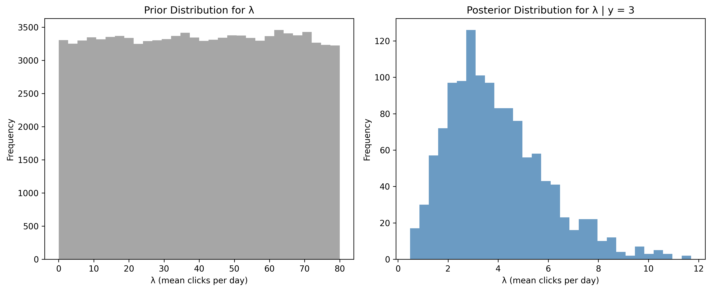
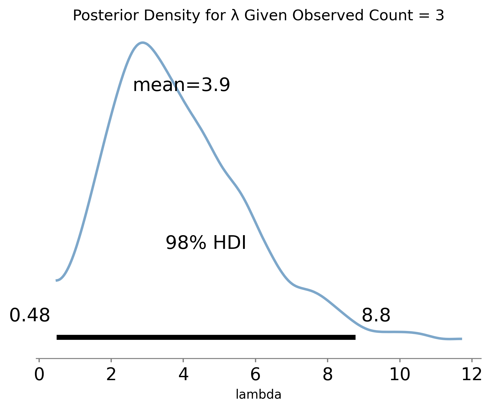
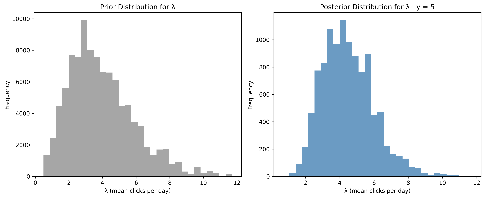
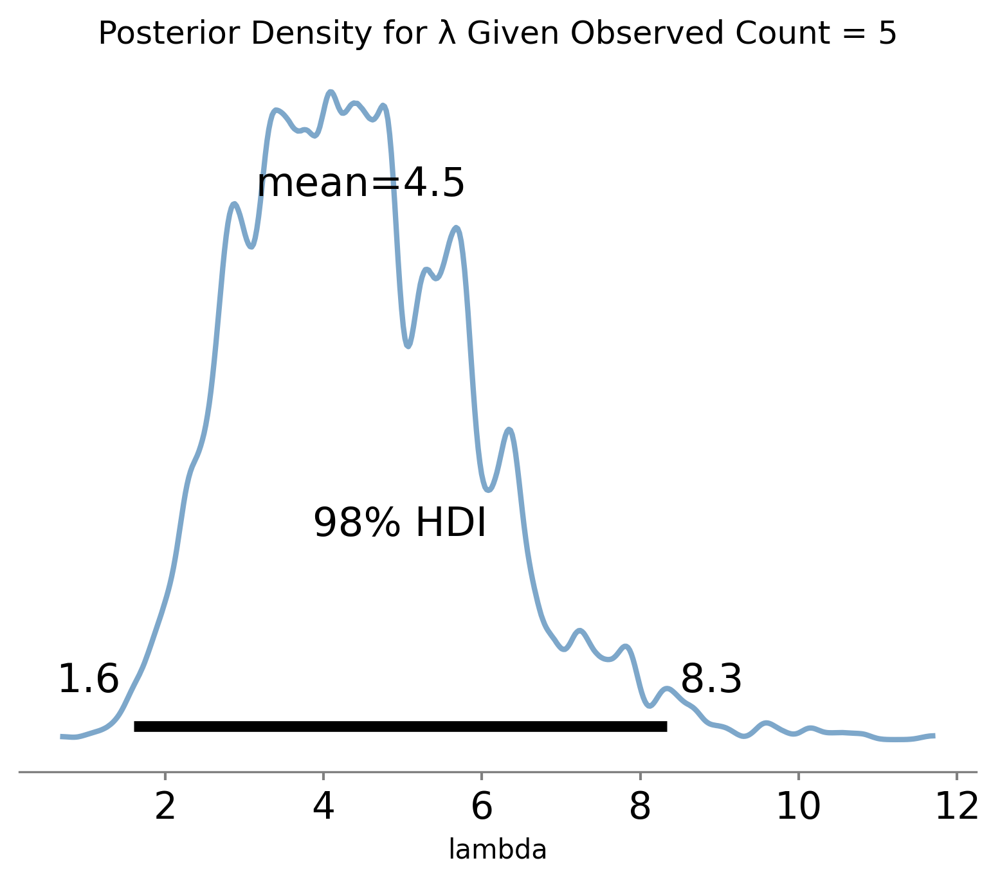
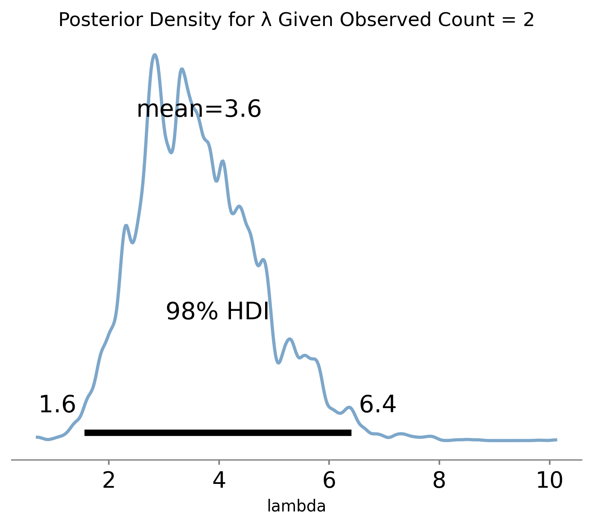

# **Bayesian Sequential Updating for Poisson Count Data**  
*A simulation‑based introduction using a toy X‑ray astronomy example*

## **Overview**
This repository demonstrates **Bayesian inference for Poisson count data** using a transparent, simulation‑based 
approach. The workflow follows the generative logic taught in introductory Bayesian courses:

1. Draw samples from a prior distribution over the Poisson rate parameter $\lambda$  
2. Simulate Poisson counts from each sampled $\lambda$  
3. Condition on the observed data by retaining only those $\lambda$ values that could have produced the observed count  
4. Visualize and analyze the resulting posterior distribution  

This approach uses **likelihood‑based rejection sampling**, a simple form of simulation‑based Bayesian inference. 
The repository begins with a **toy X‑ray astronomy example** and is structured to scale naturally toward **real 
historical and current X‑ray data**.

---

## **Scientific Motivation**
Photon arrivals in X‑ray astronomy are well modeled as a **Poisson process**, especially in the low‑count regime 
typical of faint sources. Bayesian methods are widely used in this domain because they:

- handle low counts gracefully  
- provide calibrated uncertainty  
- support sequential updating as new exposures arrive  
- integrate naturally with physical priors and hierarchical models  

This repository implements the simplest version of that workflow to make the core ideas clear and reproducible.

---

## **Toy Example: Faint X‑ray Source with Three Exposures**
We begin with a controlled, pedagogical example that mirrors real scientific conditions.

### **Statistical Model**
The model assumes that the observed photon counts $y_i$ follow a Poisson distribution, conditioned 
on a rate parameter $\lambda$:

$$
y_i \sim \text{Poisson}(\lambda)
$$

We define a non-informative Uniform prior over the plausible range of $\lambda$:

$$
\lambda \sim \text{Uniform}(0, 80)
$$

### **Observed counts**  (placed in a csv file in the data folder)
```
[3, 5, 2]
```

### **Goal**
Perform **sequential Bayesian updating** as each exposure arrives, visualizing how the posterior 
distribution for $\lambda$ evolves.

This toy example serves as a clean, reproducible foundation before moving to real X‑ray data.

---

## **Code Structure**

### **Core Functions (`functions.py`)**

#### **1. `load_csv_with_schema`**  
A robust helper function for safe, validated CSV ingestion. This routine ensures that input data is 
structurally correct before entering the Bayesian workflow. It checks that the file exists, enforces the 
expected column schema, strips whitespace from headers, applies explicit data types, and verifies that no 
missing values are present. This prevents silent data corruption and makes the pipeline reproducible and trustworthy.

```python
toy_data_path = "data/toy_data.csv"
expected_cols = ["observation", "counts_per_exposure"]
dtype_map = {"observation": "int", "counts_per_exposure": "int"}

toy_data = load_csv_with_schema(
    toy_data_path,
    expected_cols,
    dtype_map,
)

print(toy_data.head())
print("")
```

#### **2. `simulate_posterior_poisson`**  
Draws prior samples, simulates Poisson counts, and extracts posterior samples.

```python
prior_samples, posterior_samples = simulate_posterior_poisson(
    n_draws=100_000,
    observed_count=5,
    prior_distribution="uniform",
    prior_min=0.0,
    prior_max=80.0,
    seed=42,
)
```

#### **3. `plot_histograms`**  
Plots prior and posterior histograms for visual comparison.

```python
plot_histograms(prior_samples, posterior_samples, observed_count=5, bins=30)
```

#### **4. `analytic_posterior_gamma`**  
Provides the analytic Gamma posterior for comparison when the prior is flat on $[0, +\infty)$.

```python
mean, (lower, upper) = analytic_posterior_gamma(observed_count=5)
```

#### **5. `plot_posterior_density`**  
Uses ArviZ to plot posterior densities with credible intervals.

```python
idata = {"lambda": posterior_samples}
plot_posterior_density(
    idata,
    var_name="lambda",
    ci=0.94,
    color="steelblue",
)
```

#### **6. `sequential_update_poisson`**  
Performs sequential Bayesian updating across multiple exposures.

```python
history = sequential_update_poisson(
    observations=[3, 5, 2],
    n_draws=100_000,
    prior_distribution="uniform",
    prior_min=0.0,
    prior_max=80.0,
)
```

---

## **Example Workflow (`simulate_posterior_poisson.py`)**
The top‑level script demonstrates the full sequential updating process:

```python
toy_data_path = "data/toy_data.csv"
expected_cols = ["observation","counts_per_exposure"]
dtype_map = {"observation": "int", "counts_per_exposure": "int"}
toy_data = load_csv_with_schema(toy_data_path,
                     expected_cols,
                     dtype_map,
                     )

# Sequential Baysesian Driver
observations = toy_data["counts_per_exposure"].to_list()

history = sequential_update_poisson(
    observations,
    n_draws=100_000,
    prior_distribution="uniform",
    prior_min=0,
    prior_max=80,
)

for i, his in enumerate(history, start=0):
    n_bins = 30
    num_observation = his['observed']

    plot_histograms(
        his["prior_samples"],
        his["posterior_samples"],
        observed_count=num_observation,
        bins=n_bins
    )

    g = plot_posterior_density(
        his["posterior_samples"],
        "lambda",
        ci=0.98,
        color="steelblue",
        alpha=0.7,
        linewidth=2,
        title=f"Posterior Density for λ Given Observed Count = {num_observation}",
    )
    del g
```

This produces a sequence of prior/posterior histograms and posterior density plots for each exposure.

---

## **Roadmap: From Toy Example to Real Data**
This repository is intentionally structured to grow into a full scientific workflow.

Possible extensions include:

- Adding real photon‑count data from Chandra or XMM‑Newton  
- Performing sequential updating on real exposures  
- Comparing Bayesian posteriors with classical estimators  
- Incorporating background subtraction  
- Exploring hierarchical priors  
- Modeling time‑varying $\lambda$ for variable sources  
- Publishing a short technical note or arXiv preprint  

The toy example serves as a clean, reproducible foundation for these future steps.

---

## **References**
These published sources support the scientific and statistical background:

- **van Dyk, D. A. (2025).** *Bayesian Statistical Methods for Astronomy Part I: Foundations.*  
- **Kolaczyk, E. D.** *Bayesian Multiscale Methods for Poisson Count Data.*  
- **Song et al. (2025).** *A Poisson Process AutoDecoder for X‑ray Sources.*  

---

## **License**
Add your preferred license here (MIT recommended for scientific code).

---

## **Contributions**
Contributions are welcome—especially for real‑data extensions, visualization improvements, and statistical enhancements.

---

## **Visualizing the Sequential Update**
Visualizations are an integral part of Bayesian inference, helping to understand the 
posterior distribution and the impact of data on parameter estimates. This repository 
includes basic visualizations for the Poisson process, but more sophisticated visualizations 
can be added to enhance understanding and communication of results.

As each exposure is processed, the posterior distribution for $\lambda$ narrows, representing 
our increasing certainty about the source brightness.

| Step | Observed Count | Prior vs Posterior Histogram | Posterior Density (KDE) |
| :--- | :---: | :---: | :---: |
| **1** | 3 |  |  |
| **2** | 5 |  |  |
| **3** | 2 |  |  |

---

## **Appendix: Why This Method Is Sometimes Called ABC**
Although the Poisson likelihood is easy to evaluate analytically, the simulation‑based approach used in 
this repository follows the structure of **Approximate Bayesian Computation (ABC)**. In ABC methods, the 
likelihood is not evaluated directly; instead, parameters are proposed from the prior, synthetic data are 
generated from the model, and parameters are accepted only when the simulated data match the observed data. 
This “simulate → compare → accept” pattern is the defining characteristic of ABC. In our toy example, we 
apply this logic even though a closed‑form posterior exists, because it provides a transparent, generative 
view of Bayesian updating and generalizes naturally to more complex models where the likelihood may be 
difficult or impossible to compute. In that sense, the method is “approximate” in its algorithmic structure, 
not in its philosophical commitment to Bayesian inference.

---
